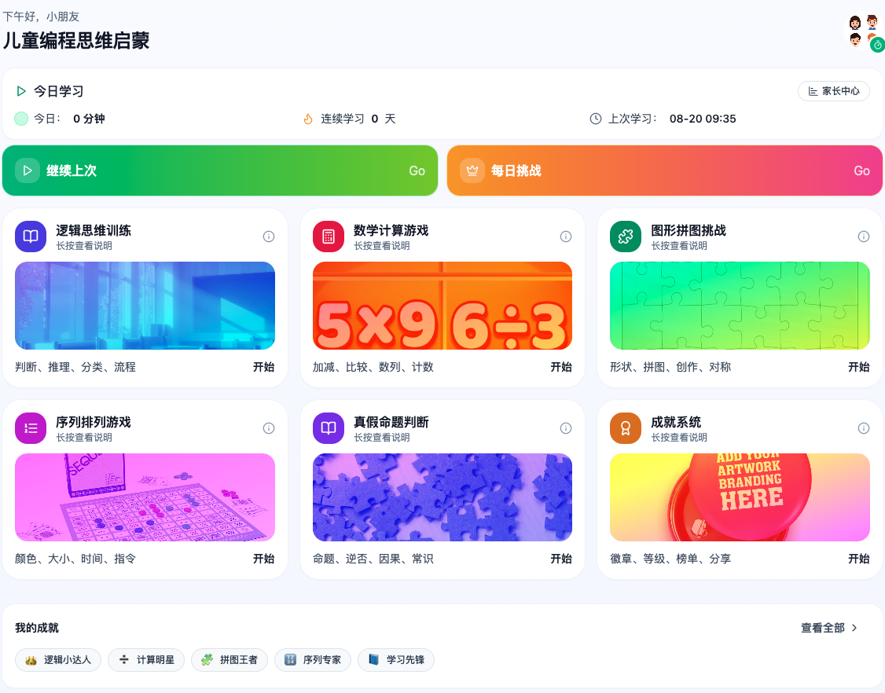

# 儿童编程思维启蒙 · 项目说明
## 项目预览



本仓库是一个基于 React + TypeScript 的教学小游戏集合，面向 6–12 岁儿童的编程思维启蒙训练，包含：加减心算、序列排序、图形拼图、逻辑判断等模块，并提供成就系统与家长中心可视化统计。所有数据仅保存在浏览器本地。

## 目录
- [功能总览](#功能总览)
- [技术栈与约束](#技术栈与约束)
- [目录结构](#目录结构)
- [开发与构建](#开发与构建)
- [数据与存储](#数据与存储)
- [成就系统](#成就系统)
- [家长中心](#家长中心)
- [设计与可访问性规范](#设计与可访问性规范)
- [扩展指南（新增小游戏/模块）](#扩展指南新增小游戏模块)
- [常见问题](#常见问题)
- [许可证与声明](#许可证与声明)

---

## 功能总览

- 首页入口（不改路由）：
  - 问候与今日统计：今日分钟数、连续学习天数、上次学习时间。
  - 今日模块分布：Top 4 模块的分钟数徽章。
  - 快速动作：继续上次、每日挑战。
  - 模块宫格：逻辑、数学、拼图、序列、成就。
  - 模块详情弹窗：封面/简介/子内容说明。
  - 抽屉容器（GameDrawer）：承载小游戏、家长中心、成就中心。

- 小游戏模块（统一 HUD：进度/难度/声音/设置/暂停/退出；结果页带复盘与 CSV 导出）：
  - 数学计算（加减 4 选 1，支持自适应难度与每题倒计时）。
  - 序列排序（拖拽数字卡片从小到大，提示会自动纠正一个位置）。
  - 图形拼图（类型匹配，将彩色图形拖入对应槽位）。
  - 逻辑判断（真假命题，100 题库，难度切换后重抽且单轮不重复）。

- 成就系统：本地计算等级/积分与徽章状态，支持复制分享文案与本地排行榜。

- 家长中心：周学习时长柱状图、正确/错误分布、模块分布、最近记录，记录筛选/导出 CSV/清空。

---

## 技术栈与约束

- Runtime：React 18 + TypeScript
- 构建：esbuild（scripts/build.mjs）
- 样式：Tailwind CSS（含 tailwind-animate）
- 图标：lucide-react
- 路由：`react-router`（使用 `HashRouter`；不使用 react-router-dom）
- 图表：recharts
- 组件：shadcn UI 已预置于 `components/ui`（请勿修改该目录）
- 重要约束（代码内已遵守）：
  - 不改动 `main.tsx`、`package.json`、`shadcn.css`
  - 首页内打开抽屉，不通过新增路由切换内容
  - 良好对比度与移动端优先
  - 统一组件化/文件内 JSDoc 说明

---

## 目录结构

仅列出与开发相关的关键路径，非完整树。

```
.
├─ package.json
├─ README.md
├─ src/
│  ├─ App.tsx                  # 路由（HashRouter）与首页入口
│  ├─ pages/
│  │  └─ Home.tsx              # 首页（入口卡片/统计/抽屉开启）
│  ├─ shared/
│  │  ├─ game/                 # 小游戏模块
│  │  │  ├─ GameDrawer.tsx
│  │  │  ├─ MathQuickGame.tsx
│  │  │  ├─ SequenceOrderGame.tsx
│  │  │  ├─ ShapePuzzleGame.tsx
│  │  │  └─ LogicTrainingGame.tsx
│  │  ├─ home/                 # 首页复用组件
│  │  │  ├─ ModuleCard.tsx
│  │  │  ├─ ModuleDetailModal.tsx
│  │  │  ├─ QuickActions.tsx
│  │  │  ├─ TodayBreakdown.tsx
│  │  │  └─ WeeklyMiniChart.tsx (示例图表；首页版本已移除)
│  │  ├─ parent/
│  │  │  └─ ParentCenter.tsx   # 家长中心（概览/记录/设置）
│  │  ├─ achievements/
│  │  │  ├─ AchievementsCenter.tsx
│  │  │  └─ AchievementsData.ts
│  │  └─ storage/
│  │     └─ StudyStorage.ts    # 本地存储与周汇总
│  └─ shadcn.css
└─ ...
```

---

## 开发与构建

> 推荐 Node.js ≥ 18

### 1) 安装依赖
```bash
npm i
# 或
npm ci
```

### 2) 本地开发
```bash
npm run dev
```
- 脚本将调用 `scripts/build.mjs` 启动开发构建与预览服务（控制台会输出本地访问地址）。
- 项目使用 `HashRouter`，本地与静态托管环境均可直接访问 `/#/`。

### 3) 生产构建
```bash
npm run build
```
- 产物输出目录由 `scripts/build.mjs` 管理（通常为 `dist/` 或工具脚本设定的临时目录）。
- 使用静态服务器（如 nginx、Vercel、Netlify）托管 `dist` 即可，需确保以静态文件方式提供并允许 `/#/` 路径访问。

---

## 数据与存储

- 记录模型 `StudyRecord`：
  - `module`: 模块名称（例如「加减法练习」）
  - `score`: 正确数
  - `total`: 总题数
  - `elapsedMs`: 用时（毫秒）
  - `timestamp`: 完成时间（毫秒时间戳）

- 本地键：
  - 学习记录：`kids-coding-study-records:v1`
  - 成就解锁：`kids-coding-achievements:v1`

- 主要方法（见 `src/shared/storage/StudyStorage.ts`）：
  - `getRecords()` / `addRecord(rec)` / `clearRecords()`
  - `getRecentRecords(n)` / `getRecordsWithinDays(days)`
  - `exportRecordsToCSV()`
  - `getWeeklySummaryFromStorage()`：返回近 7 天的分钟数与正确率聚合，以及 streak/总分钟等摘要

- 写入约定：
  - 每个小游戏完成时必须调用 `addRecord(...)`，以便家长中心与成就中心统计。

---

## 成就系统

- 定义与计算：`src/shared/achievements/AchievementsData.ts`
- 指标聚合源自 StudyStorage：
  - `sessions`、`totalAnswered`、`totalCorrect`、`bestAccuracy`、`streakDays`、`minutes`、`moduleCounts`
- 徽章示例：
  - 新手启程（1 次学习）
  - 坚持练习（10 次学习）
  - 百题勇士（累计 100 题）
  - 稳准狠（最佳正确率 ≥ 90%）
  - 连续习惯（连续 3 天）
  - 数学小能手（加减法练习 ≥ 3 次）
- 积分与等级：`points = totalCorrect`；每 50 分升 1 级（最低 Lv.1）
- 展示：`AchievementsCenter.tsx` 显示个人摘要、徽章网格与本地排行榜，支持复制分享文案

---

## 家长中心

- 位置：抽屉中打开 `ParentCenter.tsx`
- 功能：
  - 概览：7 天学习时长柱状图、正确/错误分布（分钟近似）、模块分布、最近记录
  - 记录：支持 7/30/90 天与模块筛选的表格视图，可导出 CSV、清空
  - 设置：本地数据与隐私说明（数据仅存储于本机浏览器）
- 图表依赖：`recharts`（已在依赖中）

---

## 设计与可访问性规范

- UI/UX：
  - 深色主操作按钮、浅色信息卡片与明显的 1px 环线，良好对比度
  - 移动端优先，交互目标面积 ≥ 44px
  - 反馈节奏：正确 900ms、错误/超时 1200ms 再流转

- 可访问性：
  - 主要交互均为 `<button>`，提供 `aria-label`/`title`
  - 进度条/抽屉等元素具有适当的 `role` 与 `aria-*`
  - 键盘：Enter/Space 可触发按钮

- 声音：
  - WebAudio 合成提示音，HUD 可开关；环境不支持时自动静音降级

- 路由与页面：
  - 使用 `react-router` 的 `HashRouter`；不引入 `react-router-dom`
  - 首页为唯一入口（不通过路由切换模块），抽屉承载内容

---

## 扩展指南（新增小游戏/模块）

1) 新建组件  
在 `src/shared/game/` 下创建新文件（例如 `ColorSequenceGame.tsx`），参考现有模块结构：
- HUD：进度/难度/声音/设置/暂停/退出
- 结果页：总分、复盘、只看错题、导出错题 CSV
- 完成时调用 `addRecord({ module, score, total, elapsedMs, timestamp: Date.now() })`

2) 首页接入  
在 `src/pages/Home.tsx` 的模块数组中新增一项（封面、渐变、说明等），在点击时通过 `DrawerState` 打开对应内容。

3) 统计/成就联动  
- 若需新成就：在 `AchievementsData.ts` 的 `BADGES` 中添加条目，并在 `check` 中读取统计结果（来自 `computeStats`）。

4) 命名与模块映射  
- 建议 `module` 字段使用中文明确名称，便于家长中心与徽章识别（示例：`“颜色序列”`、`“乘除法练习”`）。

---

## 常见问题

- Q1：为什么没有页面跳转？  
  A：设计为首页单入口 + 抽屉容器（GameDrawer），避免上下文切换，且便于在内嵌环境中预览。

- Q2：为什么使用 `react-router` 而非 `react-router-dom`？  
  A：项目约束要求，仅使用 `react-router`；并采用 `HashRouter` 以兼容静态托管场景。

- Q3：音频在部分设备上无声？  
  A：某些浏览器策略需要用户手势后才能创建 `AudioContext`；已在代码中做静默降级，不影响游戏流程。

- Q4：统计与成就为什么没变化？  
  A：需完成至少一局小游戏以写入数据；可在家长中心的记录页导出/清空数据验证。

- Q5：7 天趋势图在哪？  
  A：首页已移除（保持简洁），在家长中心的“概览”中可查看完整周趋势。

---

## 许可证与声明

- 本项目为教育演示用途，所有记录数据仅保存在浏览器本地（LocalStorage），不上传到任何服务器。
- 第三方图片/图标版权归属其各自权利人，仅用于演示与占位。
- 如需用于商业或大规模教学场景，请补充完善题库、隐私合规与适老化/无障碍细节，并进行充分测试。

---

如需进一步的技术文档（流程图/状态机/组件图/I18n 资源清单等），可在此基础上扩充至团队知识库（Confluence/Wiki）。
